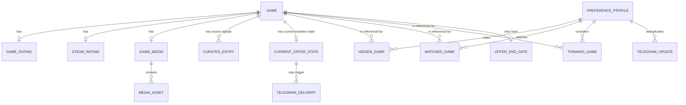

# Entity Model

## Entity Relationship Diagram

This is a normalized logical view of the current Nintendo catalog responses and JSON documents; physical persistence is denormalized into provider maps keyed by Nintendo game identifier. Telegram audit events and delivery claims use separate immutable private Blob records; they are never stored in or returned with preferences.

Bounded callback replay receipts remain internal to the preference document and are excluded from its public API shape. Permanent Telegram delivery claims and audit events are separate private Blob records and never modify preferences.

### GAME

Represents a Nintendo catalog game and its current Spanish eShop offer.

| Attribute | Description | Data Type | Length/Precision | Validation Rules |
|---|---|---|---|---|
| id | Nintendo catalog identifier used as the cross-source key | String | 50 | Not Null, Unique |
| title | Display title | String | 500 | Not Null |
| publisher | Publishing organization | String | 500 | Optional |
| description | Nintendo store excerpt | String | 500 | Optional |
| regular_price | Regular EUR price | Decimal | 10,2 | Not Null, Min: 0, Max: 99999999.99 |
| discounted_price | Current discounted EUR price | Decimal | 10,2 | Optional |
| discount_percentage | Current percentage reduction | Decimal | 10,2 | Optional |
| product_url | Nintendo product path | String | 500 | Not Null |
| platform | Nintendo platform label | String | 100 | Not Null, Value: Nintendo Switch |
| release_date | Nintendo release date used to determine the temporary IGDB refresh window | Date | - | Optional |

### PREFERENCE_PROFILE

Represents the single configured shopper's durable preference state.

| Attribute | Description | Data Type | Length/Precision | Validation Rules |
|---|---|---|---|---|
| id | Stable profile identifier | String | 50 | Not Null, Unique |
| updated_at | Time of the latest accepted preference mutation | DateTime | - | Optional |

### HIDDEN_GAME

Records that a profile has removed a game from ordinary recommendations.

| Attribute | Description | Data Type | Length/Precision | Validation Rules |
|---|---|---|---|---|
| profile_id | Owning preference profile | String | 50 | Not Null, Foreign Key (PREFERENCE_PROFILE.id) |
| game_id | Hidden Nintendo game | String | 50 | Not Null, Foreign Key (GAME.id) |

**Constraints:** Each profile and game pair must be unique.

### WATCHED_GAME

Records a profile's active price threshold for a game.

| Attribute | Description | Data Type | Length/Precision | Validation Rules |
|---|---|---|---|---|
| profile_id | Owning preference profile | String | 50 | Not Null, Foreign Key (PREFERENCE_PROFILE.id) |
| game_id | Watched Nintendo game | String | 50 | Not Null, Foreign Key (GAME.id) |
| title | Last known game title retained for notification text | String | 500 | Not Null |
| threshold | Alert threshold in EUR | Integer | 10 | Not Null, Values: 2, 5, 10 |

**Constraints:** Each profile and game pair must be unique.

### THINKING_GAME

Records that a profile is considering a game without setting a price alert.

| Attribute | Description | Data Type | Length/Precision | Validation Rules |
|---|---|---|---|---|
| profile_id | Owning preference profile | String | 50 | Not Null, Foreign Key (PREFERENCE_PROFILE.id) |
| game_id | Considered Nintendo game | String | 50 | Not Null, Foreign Key (GAME.id) |

**Constraints:** Each profile and game pair must be unique.

### TELEGRAM_UPDATE

Internal replay IDs also include `alert-reply:<SHA-256 callback ID>` claim and `alert-reply-sent:<SHA-256 callback ID>` confirmation markers for persistent Alert replies. They share the existing bounded replay buffer (1,000 metadata IDs), are excluded from public preference responses, and do not modify hidden/watched/thinking values.

Tracks completed inbound callbacks so Telegram retries cannot apply the same action twice.

| Attribute | Description | Data Type | Length/Precision | Validation Rules |
|---|---|---|---|---|
| profile_id | Owning preference profile | String | 50 | Not Null, Foreign Key (PREFERENCE_PROFILE.id) |
| update_id | Telegram callback identifier | String | 200 | Not Null, Unique |

### TELEGRAM_DELIVERY

Claims one stable offer transition or one watched alert state before sending it. The event identity is independent of the calendar day so unchanged offers are not repeated on subsequent runs. Claims and results are immutable records in a private delivery ledger, not preference metadata.

| Attribute | Description | Data Type | Length/Precision | Validation Rules |
|---|---|---|---|---|
| event_id | Stable immutable identity covering a game offer episode and price transition | String | 500 | Not Null, Unique |
| claimed_at | UTC time the first send attempt was claimed | DateTime | - | Not Null |
| metadata | Game, price, transition, and alert details | JSON | - | Optional |
| outcome | Confirmed sent, rejected, or unresolved attempt | String | 20 | Optional |
| message_id | Telegram message identifier when a send was confirmed | Integer | 19 | Optional |

**Constraints:** Each delivery key is unique for the lifetime of the event ledger; a pending or unresolved claim must never be blindly resent.

### CURRENT_OFFER_STATE

Tracks the last complete Nintendo discount observation independently of shopper preferences and homepage eligibility.

| Attribute | Description | Data Type | Length/Precision | Validation Rules |
|---|---|---|---|---|
| game_id | Nintendo game identifier | String | 50 | Not Null, Unique |
| active | Whether the latest complete snapshot includes a qualifying active discount | Boolean | - | Not Null |
| price_cents | Discounted EUR price in integer cents | Integer | 10 | Optional, Min: 0 |
| episode | Consecutive active-offer episode number | Integer | 10 | Not Null, Min: 1 |
| price_change_sequence | Price transition count within the episode | Integer | 10 | Not Null, Min: 0 |

### OFFER_END_DATE

Optional official Nintendo discount expiry evidence is stored in the separate `offer-end-dates.json` snapshot. A record is displayed only when its discounted cents match the current game price, its end is in the future, and the snapshot is no more than 36 hours old.

| Attribute | Description | Data Type | Length/Precision | Validation Rules |
|---|---|---|---|---|
| game_id | Nintendo game identifier | String | 50 | Not Null, Foreign Key (GAME.id) |
| price_cents | Discounted EUR cents represented by this expiry record | Integer | 10 | Not Null, Min: 0 |
| end_datetime | Official Nintendo discount end instant | DateTime | - | Not Null, Future at display time |
| checked_at | Time the source hook was refreshed | DateTime | - | Not Null; max age 36 hours at display time |

### TELEGRAM_AUDIT_EVENT

Append-only record for every verified inbound update and outbound Bot API attempt/result. Stored under private Blob access with no retention expiry and retrieved through a bounded, filtered authenticated API.

| Attribute | Description | Data Type | Length/Precision | Validation Rules |
|---|---|---|---|---|
| event_id | Unique event record identifier | String | 500 | Not Null, Unique |
| occurred_at | UTC timestamp | DateTime | - | Not Null |
| direction | Inbound update or outbound Bot API call | String | 10 | Not Null |
| correlation_id | Telegram update, callback, or worker operation reference | String | 200 | Optional |
| request | Redacted update or outbound method/payload | JSON | - | Optional |
| response | Telegram response, action result, or safe error description | JSON | - | Optional |

**Constraints:** Records are immutable and retained indefinitely. Secrets, bearer credentials, and bot-token-bearing URLs must be redacted before storage.

### GAME_RATING

Stores the IGDB rating match for one Nintendo game.

| Attribute | Description | Data Type | Length/Precision | Validation Rules |
|---|---|---|---|---|
| game_id | Nintendo game receiving the enrichment | String | 50 | Not Null, Foreign Key (GAME.id) |
| provider_id | Matched IGDB game identifier | Long | 19 | Not Null |
| total_rating | Combined provider score | Decimal | 10,2 | Optional |
| critic_rating | External critic score | Decimal | 10,2 | Optional |
| user_rating | Provider user score | Decimal | 10,2 | Optional |
| user_vote_count | Number of provider user ratings | Integer | 10 | Not Null, Min: 0, Max: 2147483647 |
| critic_vote_count | Number of external critic ratings | Integer | 10 | Not Null, Min: 0, Max: 2147483647 |
| matched_title | Provider title selected by matching | String | 500 | Not Null |
| confidence | Title-match confidence | Decimal | 10,2 | Not Null, Min: 0, Max: 1 |
| refreshed_at | Time the provider data was last refreshed | DateTime | - | Not Null |

### STEAM_RATING

Stores optional Steam review evidence for a Nintendo game with a reliable cross-platform match.

| Attribute | Description | Data Type | Length/Precision | Validation Rules |
|---|---|---|---|---|
| game_id | Nintendo game receiving the enrichment | String | 50 | Not Null, Foreign Key (GAME.id) |
| provider_id | Matched Steam application identifier | Long | 19 | Not Null |
| positive_percentage | Percentage of positive Steam reviews | Integer | 10 | Not Null, Min: 0, Max: 100 |
| review_count | Number of Steam reviews represented | Integer | 10 | Not Null, Min: 0, Max: 2147483647 |
| product_url | Steam store page | String | 500 | Not Null |
| matched_title | Steam title selected by matching | String | 500 | Not Null |
| refreshed_at | Time the provider data was last refreshed | DateTime | - | Optional |

### GAME_MEDIA

Stores the provenance and refresh state for a game's media collection.

Optional `igdb_match` records the validated provider game ID, title, canonical URL and validation time independently of frozen rating scores. A previous `igdb_url` is retained as `legacy_igdb_url` when a verified association supersedes it; existing assets are never removed by routine refresh.

| Attribute | Description | Data Type | Length/Precision | Validation Rules |
|---|---|---|---|---|
| id | Stable media collection identifier equal to the game identifier | String | 50 | Not Null, Unique |
| game_id | Nintendo game receiving the media | String | 50 | Not Null, Foreign Key (GAME.id) |
| source | Provider used for the media collection | String | 50 | Not Null, Values: nintendo, igdb |
| provider_url | Optional provider detail page | String | 500 | Optional |
| refreshed_at | Time the media collection was refreshed | DateTime | - | Not Null |

### MEDIA_ASSET

The existing media collection additionally accepts optional `steam_match` (positive app ID, exact matched title, publisher validation and refresh time), `asset_sources` (URL-to-provider mapping), per-video provider/source URL and direct/HLS playback URL, and `collection_complete`. Legacy Nintendo/IGDB entries remain readable. Steam matches provide store identity only and never synthesize rating votes or scores. Asset kinds additionally include `steam`; collections can include source `steam` or `mixed`.

Represents one screenshot or video retained in a game's media collection.

| Attribute | Description | Data Type | Length/Precision | Validation Rules |
|---|---|---|---|---|
| media_id | Owning media collection | String | 50 | Not Null, Foreign Key (GAME_MEDIA.id) |
| asset_type | Kind of media | String | 50 | Not Null, Values: screenshot, youtube, limelight |
| asset_url | Display or playback reference | String | 500 | Not Null |
| name | Optional asset label | String | 500 | Optional |
| thumbnail_url | Optional preview image | String | 500 | Optional |

### CURATED_ENTRY

Stores a source-specific editorial or deal-pick signal; one game can retain both Nintendo Life and NT Deals signals.

| Attribute | Description | Data Type | Length/Precision | Validation Rules |
|---|---|---|---|---|
| game_id | Nintendo game receiving the signal | String | 50 | Not Null, Foreign Key (GAME.id) |
| source | Provider defining the signal's semantics | String | 50 | Not Null, Values: nintendolife, ntdeals |
| title | Source title used for matching | String | 500 | Not Null |
| review | Editorial explanation when available | String | 500 | Optional |
| source_url | Canonical source reference | String | 500 | Not Null |
| rank | Optional editorial rank | Integer | 10 | Optional |
| metacritic_score | Optional secondary critic score | Integer | 10 | Optional |
| deal_rating | Optional secondary deal label | String | 100 | Optional |
| discount_percentage | Source-reported discount used only as context | Integer | 10 | Optional |
| days_remaining | Source-reported days until offer expiry | Integer | 10 | Optional |
| refreshed_at | Time the signal was last refreshed | DateTime | - | Optional |

**Constraints:** Each game and source pair must be unique; Nintendo Life remains the primary badge when both sources select the same game.

### DAILY_DEALS_SNAPSHOT

Private `telegram-deals.json` stores the latest complete offer state, keyed by Nintendo game ID: whether the discounted offer is active, its discounted price in cents, its active-discount episode, and its price-change sequence. It also records the snapshot date and uses a strong Blob ETag as the conditional-write revision. A complete observation that omits a game closes its active episode; a later discounted observation starts a new episode. A changed price advances the sequence. Missing state means a quiet first-run baseline; invalid or unreadable state fails closed. This record is independent of user preferences and Telegram callback metadata. Each transition delivery has a separate permanent claim/result record, allowing confirmed sends to be skipped on replay while an unknown outcome stops for operator review.
