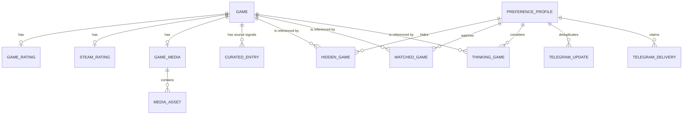

# Entity Model

## Entity Relationship Diagram

This is a normalized logical view of the current Nintendo catalog responses and JSON documents; physical persistence is denormalized into provider maps keyed by Nintendo game identifier.

Telegram replay and delivery records are private operational metadata stored beside preferences. They are not included in the public preference API response.

### GAME

Represents a Nintendo catalog game and its current Spanish eShop offer.

| Attribute | Description | Data Type | Length/Precision | Validation Rules |
|---|---|---|---|---|
| id | Nintendo catalog identifier used as the cross-source key | String | 50 | Not Null, Unique |
| title | Display title | String | 500 | Not Null |
| publisher | Publishing organization | String | 500 | Optional |
| description | Nintendo store excerpt | String | 500 | Optional |
| regular_price | Regular EUR price | Decimal | 10,2 | Not Null, Min: 0, Max: 99999999.99 |
| discounted_price | Current discounted EUR price | Decimal | 10,2 | Optional |
| discount_percentage | Current percentage reduction | Decimal | 10,2 | Optional |
| product_url | Nintendo product path | String | 500 | Not Null |
| platform | Nintendo platform label | String | 100 | Not Null, Value: Nintendo Switch |
| release_date | Nintendo release date used to determine the temporary IGDB refresh window | Date | - | Optional |

### PREFERENCE_PROFILE

Represents the single configured shopper's durable preference state.

| Attribute | Description | Data Type | Length/Precision | Validation Rules |
|---|---|---|---|---|
| id | Stable profile identifier | String | 50 | Not Null, Unique |
| updated_at | Time of the latest accepted preference mutation | DateTime | - | Optional |

### HIDDEN_GAME

Records that a profile has removed a game from ordinary recommendations.

| Attribute | Description | Data Type | Length/Precision | Validation Rules |
|---|---|---|---|---|
| profile_id | Owning preference profile | String | 50 | Not Null, Foreign Key (PREFERENCE_PROFILE.id) |
| game_id | Hidden Nintendo game | String | 50 | Not Null, Foreign Key (GAME.id) |

**Constraints:** Each profile and game pair must be unique.

### WATCHED_GAME

Records a profile's active price threshold for a game.

| Attribute | Description | Data Type | Length/Precision | Validation Rules |
|---|---|---|---|---|
| profile_id | Owning preference profile | String | 50 | Not Null, Foreign Key (PREFERENCE_PROFILE.id) |
| game_id | Watched Nintendo game | String | 50 | Not Null, Foreign Key (GAME.id) |
| title | Last known game title retained for notification text | String | 500 | Not Null |
| threshold | Alert threshold in EUR | Integer | 10 | Not Null, Values: 2, 5, 10 |

**Constraints:** Each profile and game pair must be unique.

### THINKING_GAME

Records that a profile is considering a game without setting a price alert.

| Attribute | Description | Data Type | Length/Precision | Validation Rules |
|---|---|---|---|---|
| profile_id | Owning preference profile | String | 50 | Not Null, Foreign Key (PREFERENCE_PROFILE.id) |
| game_id | Considered Nintendo game | String | 50 | Not Null, Foreign Key (GAME.id) |

**Constraints:** Each profile and game pair must be unique.

### TELEGRAM_UPDATE

Tracks completed inbound callbacks so Telegram retries cannot apply the same action twice.

| Attribute | Description | Data Type | Length/Precision | Validation Rules |
|---|---|---|---|---|
| profile_id | Owning preference profile | String | 50 | Not Null, Foreign Key (PREFERENCE_PROFILE.id) |
| update_id | Telegram callback identifier | String | 200 | Not Null, Unique |

### TELEGRAM_DELIVERY

Claims one outbound alert or digest item for one Madrid calendar date before sending it.

| Attribute | Description | Data Type | Length/Precision | Validation Rules |
|---|---|---|---|---|
| profile_id | Owning preference profile | String | 50 | Not Null, Foreign Key (PREFERENCE_PROFILE.id) |
| delivery_date | Europe/Madrid calendar date | Date | - | Not Null |
| delivery_key | Stable message identity for that date | String | 120 | Not Null |

**Constraints:** Each profile, date, and delivery key tuple must be unique.

### GAME_RATING

Stores the IGDB rating match for one Nintendo game.

| Attribute | Description | Data Type | Length/Precision | Validation Rules |
|---|---|---|---|---|
| game_id | Nintendo game receiving the enrichment | String | 50 | Not Null, Foreign Key (GAME.id) |
| provider_id | Matched IGDB game identifier | Long | 19 | Not Null |
| total_rating | Combined provider score | Decimal | 10,2 | Optional |
| critic_rating | External critic score | Decimal | 10,2 | Optional |
| user_rating | Provider user score | Decimal | 10,2 | Optional |
| user_vote_count | Number of provider user ratings | Integer | 10 | Not Null, Min: 0, Max: 2147483647 |
| critic_vote_count | Number of external critic ratings | Integer | 10 | Not Null, Min: 0, Max: 2147483647 |
| matched_title | Provider title selected by matching | String | 500 | Not Null |
| confidence | Title-match confidence | Decimal | 10,2 | Not Null, Min: 0, Max: 1 |
| refreshed_at | Time the provider data was last refreshed | DateTime | - | Not Null |

### STEAM_RATING

Stores optional Steam review evidence for a Nintendo game with a reliable cross-platform match.

| Attribute | Description | Data Type | Length/Precision | Validation Rules |
|---|---|---|---|---|
| game_id | Nintendo game receiving the enrichment | String | 50 | Not Null, Foreign Key (GAME.id) |
| provider_id | Matched Steam application identifier | Long | 19 | Not Null |
| positive_percentage | Percentage of positive Steam reviews | Integer | 10 | Not Null, Min: 0, Max: 100 |
| review_count | Number of Steam reviews represented | Integer | 10 | Not Null, Min: 0, Max: 2147483647 |
| product_url | Steam store page | String | 500 | Not Null |
| matched_title | Steam title selected by matching | String | 500 | Not Null |
| refreshed_at | Time the provider data was last refreshed | DateTime | - | Optional |

### GAME_MEDIA

Stores the provenance and refresh state for a game's media collection.

| Attribute | Description | Data Type | Length/Precision | Validation Rules |
|---|---|---|---|---|
| id | Stable media collection identifier equal to the game identifier | String | 50 | Not Null, Unique |
| game_id | Nintendo game receiving the media | String | 50 | Not Null, Foreign Key (GAME.id) |
| source | Provider used for the media collection | String | 50 | Not Null, Values: nintendo, igdb |
| provider_url | Optional provider detail page | String | 500 | Optional |
| refreshed_at | Time the media collection was refreshed | DateTime | - | Not Null |

### MEDIA_ASSET

Represents one screenshot or video retained in a game's media collection.

| Attribute | Description | Data Type | Length/Precision | Validation Rules |
|---|---|---|---|---|
| media_id | Owning media collection | String | 50 | Not Null, Foreign Key (GAME_MEDIA.id) |
| asset_type | Kind of media | String | 50 | Not Null, Values: screenshot, youtube, limelight |
| asset_url | Display or playback reference | String | 500 | Not Null |
| name | Optional asset label | String | 500 | Optional |
| thumbnail_url | Optional preview image | String | 500 | Optional |

### CURATED_ENTRY

Stores a source-specific editorial or deal-pick signal; one game can retain both Nintendo Life and NT Deals signals.

| Attribute | Description | Data Type | Length/Precision | Validation Rules |
|---|---|---|---|---|
| game_id | Nintendo game receiving the signal | String | 50 | Not Null, Foreign Key (GAME.id) |
| source | Provider defining the signal's semantics | String | 50 | Not Null, Values: nintendolife, ntdeals |
| title | Source title used for matching | String | 500 | Not Null |
| review | Editorial explanation when available | String | 500 | Optional |
| source_url | Canonical source reference | String | 500 | Not Null |
| rank | Optional editorial rank | Integer | 10 | Optional |
| metacritic_score | Optional secondary critic score | Integer | 10 | Optional |
| deal_rating | Optional secondary deal label | String | 100 | Optional |
| discount_percentage | Source-reported discount used only as context | Integer | 10 | Optional |
| days_remaining | Source-reported days until offer expiry | Integer | 10 | Optional |
| refreshed_at | Time the signal was last refreshed | DateTime | - | Optional |

**Constraints:** Each game and source pair must be unique; Nintendo Life remains the primary badge when both sources select the same game.

### DAILY_DEALS_SNAPSHOT

Private `telegram-deals.json` stores the sorted eligible Nintendo game IDs from the last successful daily delivery and its Madrid date. A strong Blob ETag is the conditional-write revision. Missing state means first-run baseline; invalid or unreadable state fails closed. It is independent of user preferences and Telegram callback metadata.
